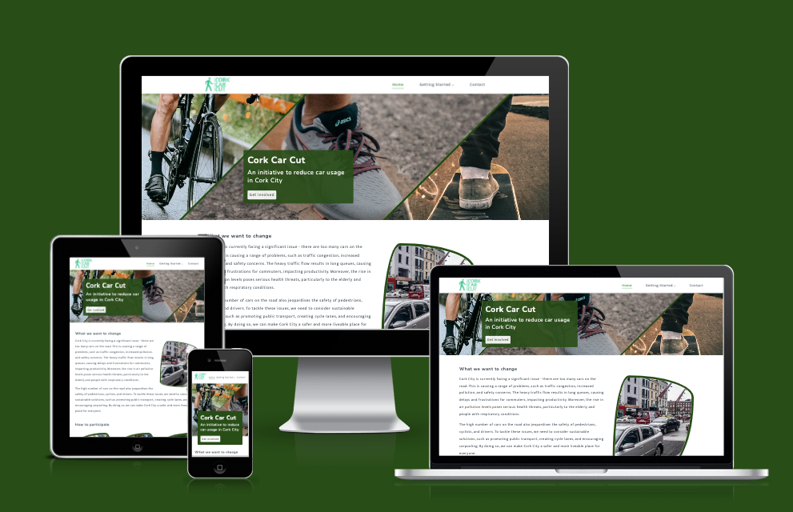
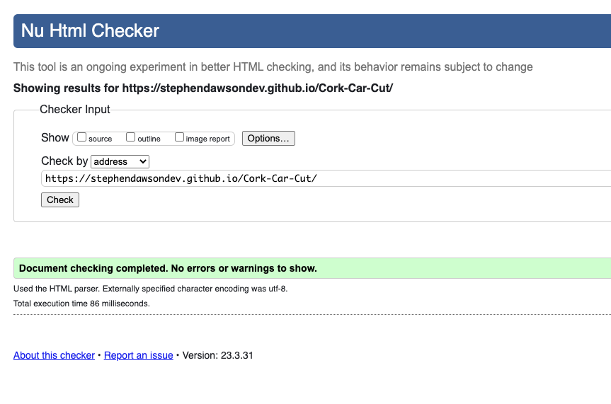
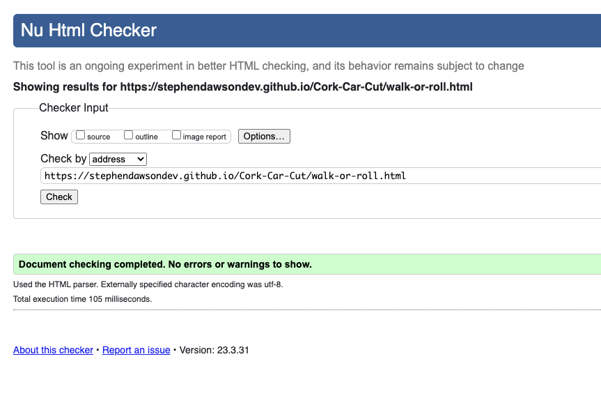
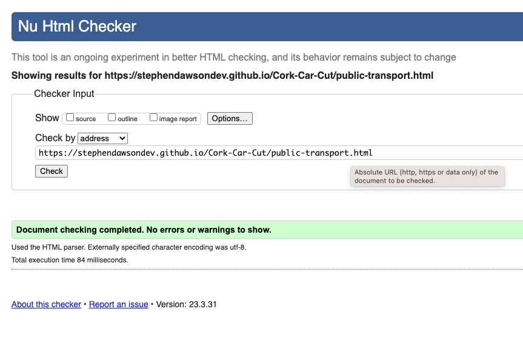
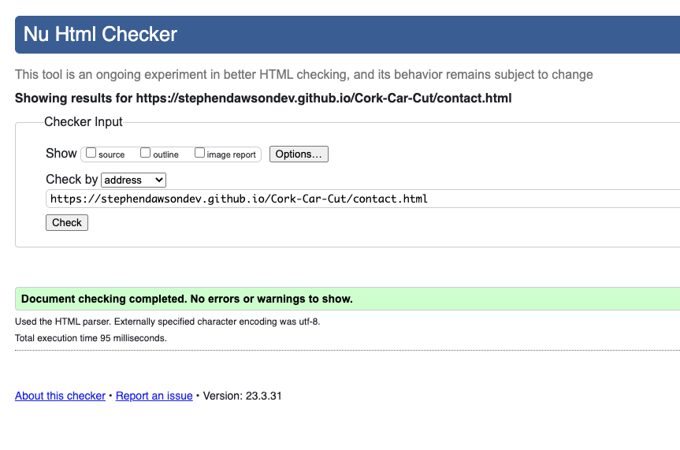

<h1 align="center">Cork Car Cut Website</h1>

[Click here to view the live Cork Car Cut Website.](https://stephendawsondev.github.io/Cork-Car-Cut)

The Cork Car Cut is an initiative from the Cork City Council to encourage car users to reduce their car usage. The project sets out to provide a number of alternative transport methods that Cork City citizens can use instead of their cars. Since it is a Government initiative, the site is aimed at all ages and social groups.

<h2 align="center"></h2>

## User Experience (UX)

-   ### User stories

    -   #### First Time Visitor Goals

        1. As a First Time Visitor, I want to understand the main purpose of the initiative and how it can benefit me.
        2. As a First Time Visitor, I want to easily navigate through the site to find relevant information about the different forms of alternative transport available.
        3. As a First Time Visitor, I want to see the organization's (Cork City Council) social media presence to gauge its trustworthiness.

    -   #### Returning Visitor Goals

        1. As a Returning Visitor, I want to easily find a way to contact the organizers of the initiative in case I have any questions or suggestions.
        2. As a Returning Visitor, I want to quickly navigate to the different forms of alternative transport pages that suit my needs.

    -   #### Frequent User Goals
        1. As a Frequent User, I want to stay informed about new alternative forms of transport that are added to the initiative.
        2. As a Frequent User, I want to see updated resources on my most suited forms of alternate transport.

-   ### Design
    -   #### Colour Scheme
        -   The two main colours used are light and dark green, which are associated with the environment. The tone of the initiative is environmental, so the colours work well.
    -   #### Typography
        -   Since it is a Government website, I felt the fonts needed to be simple and readable. I chose "Mukta Vaani" as the body font for its legibility and readability. "Nunito" was selected as the h1-h3 header fonts, while "Dosis" was chosen for the h4-h6 header fonts. All three fonts have Sans Serif as a fallback for consistency and compatibility purposes.
    -   #### Imagery
        -   The images used help the user understand what the initiative is about quickly. The homepage hero banner is shows two alternate forms of transport on mobile and three on large screen sizes. There are also images with each alternative form of transport card so that it is easy to discern what each is for. All accompanying images also have a unique border radii, resembling car wing mirrors, which serve to add some character to the site.

*   ### Wireframes

    -   [View Homepage Desktop and Mobile Wireframe](assets/images/readme-images/wireframes/Homepage.png)

    -   [View Car Alternatives page Wireframe](assets/images/readme-images/wireframes/Car-alternatives.png)

    -   [View Contact Us Page Wireframe](assets/images/readme-images/wireframes/Contact-page.png)

## Features

-   Responsive on all device sizes
-   Clean and user-friendly interface design
-   Fast loading speed
-   Clear and concise navigation
-   Accessible

## Technologies Used

### Languages Used

-   [HTML5](https://en.wikipedia.org/wiki/HTML5)
-   [CSS3](https://en.wikipedia.org/wiki/Cascading_Style_Sheets)
-   [JavaScript](https://en.wikipedia.org/wiki/JavaScript)

### Frameworks, Libraries & Programs Used

1. [Canva:](https://www.canva.com/)
    - Canva was used to make the Cork Car Cut logo.
2. [Google Fonts:](https://fonts.google.com/)
    - Google fonts were used to import the 'Mukta Vaani', 'Nunito' and 'Dosis' fonts into the style.css file which are used on all pages throughout the project.
3. [Font Awesome:](https://fontawesome.com/)
    - Font Awesome was used on all pages throughout the website to add social icons to the footer and a chevron to the header, as well as icons for the car-alternative cards on the homepage for aesthetic and UX purposes.
4. [Git](https://git-scm.com/)
    - Git was used for version control by utilizing the Gitpod (and briefly Code Anywhere) terminal to commit to Git and Push to GitHub.
5. [GitHub:](https://github.com/)
    - GitHub is used to store the projects code after being pushed from Git.
6. [Balsamiq:](https://balsamiq.com/)
    - Balsamiq was used to create the [wireframes](assets/images/readme-images/wireframes) during the design process.
7. [Box Shadow Generator:](https://cssgenerator.org/box-shadow-css-generator.html)
    - Used to generate the box shadow for the sticky header
8. [Fancy Border Radius Generator:](https://mdbootstrap.com/docs/standard/tools/design/fancy-border-radius/)
    - Fancy border radius generator was used to create the unusal accompanying image shapes that were used on the homepage and contact page.
9. [SVG Repo:](https://www.svgrepo.com/)
    - SVG Repo was used once for the icon of the skateboarder, which wasn't available on FontAwesome.
## Testing

The W3C Markup Validator and W3C CSS Validator Services were used to validate every page of the project to ensure there were no syntax errors in the project.

-   [W3C Markup Validator:](https://validator.w3.org/)
    <details><summary>Homepage (Click to expand)</summary>
    <br>
    
    </details>
    <details><summary>Walk or roll page (Click to expand)</summary>
    <br>
    
    </details>
    <details><summary>Running page (Click to expand)</summary>
    <br>
    
    </details>
    <details><summary>Cycling page (Click to expand)</summary>
    <br>
    
    </details>
    <details><summary>Skating page (Click to expand)</summary>
    <br>
    
    </details>
    <details><summary>Public Transport page (Click to expand)</summary>
    <br>
    
    </details>
    <details><summary>Carpool page (Click to expand)</summary>
    <br>
    
    </details>
    <details><summary>Contact page (Click to expand)</summary>
    <br>
    
    </details>

-   [W3C CSS Validator](https://jigsaw.w3.org/css-validator/) - [Results](http://jigsaw.w3.org/css-validator/validator?lang=en&profile=css3svg&uri=https%3A%2F%2Fstephendawsondev.github.io%2FCork-Car-Cut%2F&usermedium=all&vextwarning=&warning=1)

### Testing User Stories from User Experience (UX) Section

-   #### First Time Visitor Goals

    1. As a First Time Visitor, I want to understand the main purpose of the initiative and how it can benefit me.

        1. Upon entering the site, users are presented with a hero image that has 2-3 images of alternative forms of transport, depending on the screen size. There is also an overlay (or semi-overlay on mobile) that has the clear and concise name "Cork Car Cut" with a clarifying subheading and a call-to-action button.
        2. The main point is made immediately with the hero image and its text overlay.
        3. The user can click the call to action button to scroll to the how to parcipate section to get started quickly, they can scroll through the site normally, or they can use the navigation menu items. 

    2. As a First Time Visitor, I want to easily navigate through the site to find relevant information about the different forms of alternative transport available.

        1. The site allows users to quickly navigate using the navigation menu items to find the different alternative transport methods to get started, or they can arrive there by scrolling down and coming to the "How to participate" section.
        2. The header is sticky so that even if the user scrolls down too far, they can always use the navigation menu to go where they want. The navigation and logo both go to the homepage, and leaving "Home" as a menu item was deliberate so the user doesn't feel stuck.
        3. The footer also contains a link to the contact page as the footer is often where you find policy and contact information. When the user gets to the footer, they can easily click the link if they want to contact Cork City Council for more information.

    3. As a First Time Visitor, I want to see the organization's (Cork City Council) social media presence to gauge its trustworthiness.
        1. In the footer, I have included the Cork City Council logo and a caption that the initiative is from the Cork City Council. 
        2. In the footer, there are also links to the Cork City Council's website, one of their resources on transportation and social icons that lead to their social media pages.
        3. On the Contact page, there is also an image of Cork City Hall, where the City Council meet, as well as the Cork City Countcil's address.

-   #### Returning Visitor Goals

    1. As a Returning Visitor, I want to easily find a way to contact the organizers of the initiative in case I have any questions or suggestions.

        1. The header navigation and footer both contain a link to the Contact page so that the user can easily navigate there.
        2. The footer contains social media links so that the user can find the relevant social media accounts of the City Council.
        3. On the Contact page, they can use a contact form to send a message to the City Council, and also they can find the address and accompanying map below the contact form.

    2. As a Returning Visitor, I want to quickly navigate to the different forms of alternative transport pages that suit my needs.

        1. The call-to-action button scrolls down to the "How to partipate" section, which has all the alternative forms of transport and accompanying images for clarity.
        2. The header is sticky so that wherever the user is on the page, it is accessible. The header contains a dropdown with all the alternative forms of transport available.

-   #### Frequent User Goals

    1. As a Frequent User, I want to stay informed about new alternative forms of transport that are added to the initiative.

        1. They new forms of alternative transform would be added to the navigation menu.
        2. New forms of transport can also be found in the "How to participate" section.

    2. As a Frequent User, I want to see updated resources on my most suited forms of alternate transport.

        1. On each alternative-transport page, there are some suggestions of how to get involved that related to that particular form of transport. The user can refer here to get see any additional resources related to that form of transport.
        2. The user has an option to get more information on the contact form by clicking the appropriate radio button.

### Further Testing

-   The Website was tested on Google Chrome, Mozilla Firefox and Safari browsers.
-   The website was viewed on a variety of devices such as Desktop, Laptop and iPhone 8 and 11.
-   The form was tested to ensure it was submitting correctly
-   Page links were test to ensure they opened in new tabs when necessary and to the correct destinations, or didn't open in new tabs to the correct destination.
-   Family members were asked to review the site and documentation to point out any bugs and/or user experience issues.

### Bugs encountered

- The header was overlapping my section title when I used the scroll to section. I was able to resolve it by using the `scroll-margin-top` CSS property, which I learned about on the [MDN Website](https://developer.mozilla.org/en-US/docs/Web/CSS/scroll-margin-top).
- For the dropdown menu in the navigation, the JavaScript I had was using the `toggleAttribute` method, but it was removing the `aria-expanded` attribute instead of setting it to false. I resolved that by using `setAttribute` instead of `toggleAttribute` since I was able to specify its value.
- On my product cards, the images were overflowing their container when I added a border to them. I fixed this bug by adding `box-sizing: border-box` to them so that it factored in the width of the border too.
- The image in the "What we want to change" section was running over into the section below it on larger screen sizes. I found this was because the image was using float, so I instead used flexbox for its layout on larger screen sizes.

## Deployment

### GitHub Pages

The project was deployed to GitHub Pages using the following steps...

1. Log in to GitHub and locate the [Cork Car Cut Github Repository](https://github.com/stephendawsondev/Cork-Car-Cut)
2. At the top of the Repository (not top of page), locate the "Settings" Button on the menu.
3. Scroll down the Settings page until you locate the "GitHub Pages" Section.
4. Under "Source", click the dropdown called "None" and select "Master Branch".
5. The page will automatically refresh.
6. Scroll back down through the page to locate the now [published site](https://stephendawsondev.github.io/Cork-Car-Cut) in the "GitHub Pages" section.

### Forking the GitHub Repository

By forking the GitHub Repository we make a copy of the original repository on our GitHub account to view and/or make changes without affecting the original repository by using the following steps...

1. Log in to GitHub and locate the [Cork Car Cut Github Repository](https://github.com/stephendawsondev/Cork-Car-Cut)
2. At the top of the Repository (not top of page) just above the "Settings" Button on the menu, locate the "Fork" Button.
3. You should now have a copy of the original repository in your GitHub account.

### Making a Local Clone

1. Log in to GitHub and locate the [Cork Car Cut Github Repository](https://github.com/stephendawsondev/Cork-Car-Cut)
2. Under the repository name, click "Clone or download".
3. To clone the repository using HTTPS, under "Clone with HTTPS", copy the link.
4. Open Git Bash
5. Change the current working directory to the location where you want the cloned directory to be made.
6. Type `git clone`, and then paste the URL you copied in Step 3.

```
$ git clone https://github.com/stephendawsondev/Cork-Car-Cut
```

7. Press Enter. Your local clone will be created.

```
$ git clone https://github.com/stephendawsondev/Cork-Car-Cut
> Cloning into `CI-Clone`...
> remote: Counting objects: 10, done.
> remote: Compressing objects: 100% (8/8), done.
> remove: Total 10 (delta 1), reused 10 (delta 1)
> Unpacking objects: 100% (10/10), done.
```

[Click here to retrieve pictures for some of the buttons and more detailed explanations of the cloning process](https://help.github.com/en/github/creating-cloning-and-archiving-repositories/cloning-a-repository#cloning-a-repository-to-github-desktop).

## Credits

### Code

-   [Box Shadow Generator](https://cssgenerator.org/box-shadow-css-generator.html) was used to generate the box shadow for the sticky header

- [Fancy Border Radius Generator](https://mdbootstrap.com/docs/standard/tools/design/fancy-border-radius/) was used to create the unusal accompanying image shapes that were used on the homepage and contact page.

-   [MDN Web Docs](https://developer.mozilla.org/) : For the contact forms structre for the radio buttons and their labels in the contact form.

### Content

-   All content was written by the developer.

### Media

-   All Images were created by the developer.

### Acknowledgements

-   My Mentor for continuous helpful feedback.